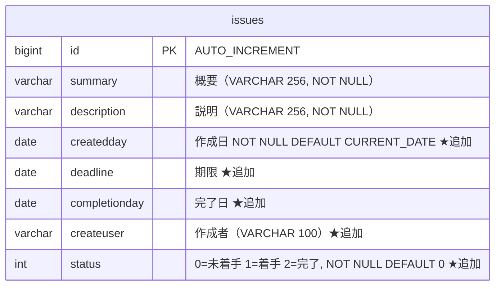

# 課題01：テーブル定義の追加

| 項目 | 内容 |
|------|------|
| 難易度 | ★☆☆☆☆☆（1/6） |
| 重要度 | ★★★★★☆（5/6） |
| 前提課題 | なし（最初の課題です） |
| 学習項目 | DBへの項目追加・初期データの修正 |
| 修正対象 | `schema.sql` / `data.sql` |

---

## 🎯 背景・目的

現在の課題管理アプリは「概要」「説明」しか保持していません。
今後「期限を表示したい」「担当者を出したい」「進捗ステータスで絞りたい」といった拡張をしていくために、**まずはDBに必要な項目（カラム）を追加**します。

土台となるテーブル定義を整えるのがこの課題のゴールです。

---

## 📋 やること（仕様）

`issues` テーブルに以下の5項目を追加し、既存の初期データも新しい項目に合わせて修正します。

| 日本語名 | カラム名 | 型 | 内容 | 制約・備考 |
|----------|----------|----|------|-----------|
| 作成日 | `createdday` | `DATE` | 課題の作成日 | `NOT NULL` / `DEFAULT (CURRENT_DATE)` |
| 期限 | `deadline` | `DATE` | 課題の期限 | － |
| 完了日 | `completionday` | `DATE` | 課題の完了日 | － |
| 作成者 | `createuser` | `VARCHAR(100)` | 作成者の名前 | － |
| ステータス | `status` | `INTEGER` | 進捗（`0`:未着手 / `1`:着手 / `2`:完了） | `NOT NULL` / `DEFAULT 0` |

### 完成後の `issues` テーブル



---

## 📁 修正対象ファイル

| ファイル | 修正内容 |
|----------|----------|
| `src/main/resources/schema.sql` | `create table issues` に5カラムを追加 |
| `src/main/resources/data.sql` | `insert` 文に追加カラムの値を設定 |

> ℹ️ このアプリは **H2（インメモリDB）** を使っており、起動のたびに `schema.sql`（テーブル作成）→ `data.sql`（初期データ投入）が実行されます。SQLを直接書き換えるだけでテーブル定義を変更できます。

---

## ✅ 動作確認

実装後、アプリを起動して以下を確認してください（この時点では**画面表示は変わりません**。エラーなく動くこと＝デグレードしていないことの確認です）。

- [ ] 一覧画面（<http://localhost:8080/issues>）が表示できる
- [ ] 課題の追加ができる
- [ ] 詳細画面が表示できる
- [ ] アプリ起動時にSQLエラーが出ていない（コンソールを確認）

---

## 💡 ヒント

<details>
<summary>カラム追加のSQLの書き方がわからない</summary>

`create table` の中で、カラム名・型・制約をカンマ区切りで並べます。

```sql
カラム名 型 制約
```

例：`createdday DATE NOT NULL DEFAULT (CURRENT_DATE)`

</details>

<details>
<summary>既存データ（data.sql）の直し方がわからない</summary>

`insert into issues (...) values (...)` の **カラムリスト** と **値リスト** の両方に、追加した項目を足します。日付は `'2022-6-6'` のように文字列で書けます。`status` は `0`〜`2` の数値です。

</details>

---

## 🔗 参考リンク

- [H2 Database - CREATE TABLE](http://www.h2database.com/html/commands.html#create_table)
- [Spring Boot Database Initialization（公式）](https://docs.spring.io/spring-boot/docs/2.6.x/reference/html/howto.html#howto.data-initialization)

---

➡️ 次の課題：[02 一覧に項目を追加](02_list-add-columns.md)
