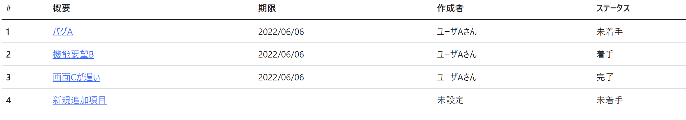

# 課題02：一覧に項目を追加

| 項目 | 内容 |
|------|------|
| 難易度 | ★★★☆☆☆（3/6） |
| 重要度 | ★★★★★☆（5/6） |
| 前提課題 | [01 テーブル定義の追加](01_table-definition.md) |
| 学習項目 | 日付のフォーマット・表示項目の編集・表示用メソッド |
| 修正対象 | `IssueEntity.java` / `list.html` |

---

## 🎯 背景・目的

課題01でDBに「期限・作成者・ステータス」を追加しました。
しかし一覧画面にはまだ表示されていません。この課題では、**追加した項目を一覧画面に表示**します。

単に値を出すだけでなく、

- 日付は **`yyyy/MM/dd` 形式**に整える
- 作成者が未設定なら **「未設定」**、設定済みなら **「○○さん」**
- ステータスの数値を **「未着手 / 着手 / 完了」** という日本語

のように、**ユーザーが読みやすい形に変換して表示**するのがポイントです。

---

## 📋 やること（仕様）

一覧画面に以下の3列を追加します。

| 表示列 | 元データ | 表示ルール |
|--------|----------|-----------|
| 期限 | `deadline` | `yyyy/MM/dd` 形式 |
| 作成者 | `createuser` | `null` の場合 → `未設定` ／ それ以外 → `（名前）さん` |
| ステータス | `status` | `0` → `未着手` ／ `1` → `着手` ／ `2` → `完了` |

### 🖼 完成イメージ

「期限」「作成者」「ステータス」列が追加され、`未設定` 表示やステータスの日本語化ができています。



---

## 📁 修正対象ファイル

| ファイル | 修正内容 |
|----------|----------|
| `src/main/java/com/example/its/domain/issue/IssueEntity.java` | 追加カラムに対応するフィールドと、**表示用メソッド**（作成者・ステータスの変換）を追加 |
| `src/main/resources/templates/issues/list.html` | テーブルに3列を追加して表示 |

> 💡 **考え方のコツ**：「`null` の場合は未設定」「数値を日本語に」といった**表示のための変換ロジック**は、HTML側に書くと複雑になりがちです。`IssueEntity` に **`getXxxView()` のような表示用メソッド**を用意すると、画面側がスッキリします。

---

## ✅ 動作確認

- [ ] 一覧画面に「期限」「作成者」「ステータス」が表示される
- [ ] 期限が `yyyy/MM/dd` 形式で表示される
- [ ] 作成者が未設定の課題は「未設定」と表示される
- [ ] ステータスが「未着手 / 着手 / 完了」と日本語で表示される
- [ ] 課題の追加ができる（デグレード確認）
- [ ] 詳細画面が表示できる（デグレード確認）

---

## 💡 ヒント

実装方法はいくつもありますが、ここでは比較的ラクな方法を紹介します。

<details>
<summary>① 日付を yyyy/MM/dd 形式で表示したい</summary>

Thymeleaf の `#dates.format` を使うと、`Date` 型を好きな書式の文字列に変換できます。

```html
<td th:text="${#dates.format(issue.deadline,'yyyy/MM/dd')}">(deadline)</td>
```

</details>

<details>
<summary>② ステータスの数字を文字列に変換したい</summary>

HTML側で `if` を並べるより、`IssueEntity` に「ステータスを文字列で返すメソッド」を1つ追加するのがラクです。

```html
<td th:text="${issue.getStatusView()}">(status)</td>
```

</details>

<details>
<summary>③ 表示用メソッドの実装例（ネタバレ注意）</summary>

`IssueEntity` に以下のようなメソッドを追加するイメージです。まずは自分で書いてみてから確認しましょう。

```java
public String getStatusView() {
    switch (status) {
        case 1:
            return "着手";
        case 2:
            return "完了";
    }
    return "未着手";
}

public String getCreateuserView() {
    if (createuser == null) {
        return "未設定";
    }
    return createuser + "さん";
}
```

</details>

---

➡️ 次の課題：[03 詳細に項目を追加](03_detail-add-columns.md)
