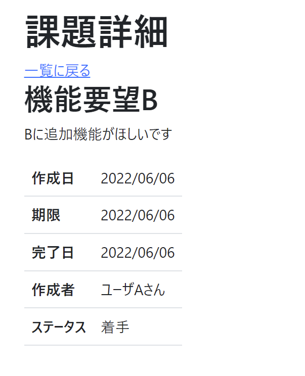

# 課題03：詳細に項目を追加

| 項目 | 内容 |
|------|------|
| 難易度 | ★★★☆☆☆（3/6） |
| 重要度 | ★★★★★☆（5/6） |
| 前提課題 | [02 一覧に項目を追加](02_list-add-columns.md) |
| 学習項目 | 詳細画面での項目表示・日付フォーマット |
| 修正対象 | `detail.html` |

---

## 🎯 背景・目的

課題02で一覧画面に項目を表示できるようになりました。
今度は **詳細画面** にも、課題01で追加した「作成日・期限・完了日・作成者・ステータス」を表示します。

一覧と同じ表示ルール（日付は `yyyy/MM/dd`、作成者は「未設定 / ○○さん」、ステータスは日本語）を、詳細画面でも適用します。

---

## 📋 やること（仕様）

詳細画面に以下を表示します。

| 表示項目 | 元データ | 表示ルール |
|----------|----------|-----------|
| 作成日 | `createdday` | `yyyy/MM/dd` |
| 期限 | `deadline` | `yyyy/MM/dd` |
| 完了日 | `completionday` | `yyyy/MM/dd` |
| 作成者 | `createuser` | `null` → `未設定` ／ それ以外 → `（名前）さん` |
| ステータス | `status` | `0`→`未着手` ／ `1`→`着手` ／ `2`→`完了` |

### 🖼 完成イメージ



---

## 📁 修正対象ファイル

| ファイル | 修正内容 |
|----------|----------|
| `src/main/resources/templates/issues/detail.html` | 表に項目を追加して表示 |

> 💡 課題02で `IssueEntity` に作った表示用メソッド（`getCreateuserView()` / `getStatusView()`）を、詳細画面でもそのまま使えます。

---

## ✅ 動作確認

- [ ] 詳細画面に「作成日・期限・完了日・作成者・ステータス」が表示される
- [ ] 日付が `yyyy/MM/dd` 形式で表示される
- [ ] 作成者・ステータスが一覧と同じルールで表示される

---

## 💡 ヒント

<details>
<summary>項目の追加方法</summary>

詳細画面は表（`<table>`）で項目を並べています。1行（`<tr>`）を追加し、`<th>` に項目名、`<td>` に値を `th:text` で出力します。日付は `#dates.format` を使います。

```html
<tr>
    <th>作成日</th>
    <td th:text="${#dates.format(issue.createdday,'yyyy/MM/dd')}"></td>
</tr>
```

</details>

---

⬅️ [02 一覧に項目を追加](02_list-add-columns.md) ／ 🏠 [課題一覧](README.md) ／ ➡️ [04 作成に項目を追加](04_create-add-fields.md)
