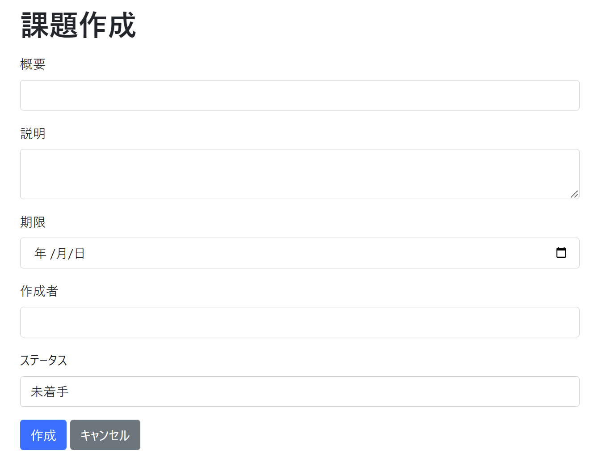
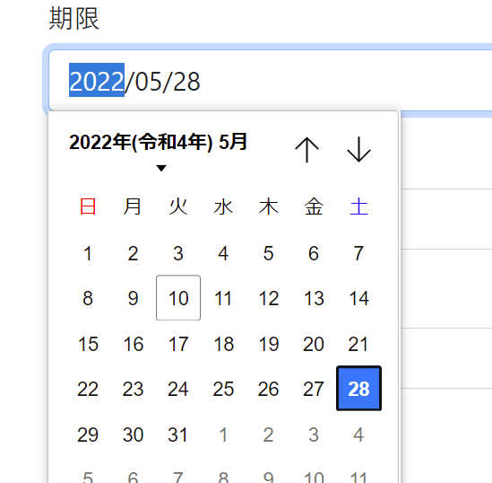
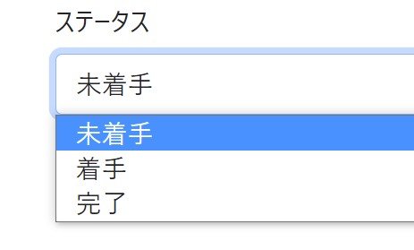

# 課題04：作成に項目を追加

| 項目 | 内容 |
|------|------|
| 難易度 | ★★★★☆☆（4/6） |
| 重要度 | ★★★★★☆（5/6） |
| 前提課題 | [03 詳細に項目を追加](03_detail-add-columns.md) |
| 学習項目 | フォームの項目追加・日付項目の入力・バリデーション |
| 修正対象 | `IssueForm.java` / `IssueController.java` / `IssueService.java` / `IssueRepository.java` / `creationForm.html` |

---

## 🎯 背景・目的

これまでは表示側を整えてきました。この課題では **入力側（課題作成画面）** に「期限・作成者・ステータス」を追加し、新しい項目を登録できるようにします。

表示と違って入力では、

- 日付（期限）を `Date` 型として受け取る
- ステータスをプルダウンで選ぶ
- 入力チェック（バリデーション）をかける

といった、フォームならではの処理が必要になります。

---

## 📋 やること（仕様）

作成画面に「期限・作成者・ステータス」の入力欄を追加し、登録できるようにします。バリデーションは以下の通り。

| 項目 | バリデーション |
|------|----------------|
| 概要・説明 | 必須・文字数チェック |
| 期限 | 日付として正しいこと |

### 🖼 完成イメージ

| 作成フォーム | 期限（日付ピッカー） | ステータス（選択） |
|:---:|:---:|:---:|
|  |  |  |

---

## 📁 修正対象ファイル

| ファイル | 修正内容 |
|----------|----------|
| `src/main/java/com/example/its/web/issue/IssueForm.java` | 入力項目（期限・作成者・ステータス）のフィールドとバリデーションを追加 |
| `src/main/java/com/example/its/web/issue/IssueController.java` | 作成処理でフォームを受け取る |
| `src/main/java/com/example/its/domain/issue/IssueService.java` | `create(IssueForm form)` で登録処理 |
| `src/main/java/com/example/its/domain/issue/IssueRepository.java` | `insert` に追加項目を渡す |
| `src/main/resources/templates/issues/creationForm.html` | 入力欄（日付・作成者・ステータス）を追加 |

> 💡 基本的な処理は **業務ロジック（`IssueService`）** に書きます。引数が増えてきたら、`String` を個別に渡すのではなく **フォームオブジェクト（`IssueForm`）ごと渡す** とスッキリします。

---

## ✅ 動作確認

- [ ] 課題の追加ができる
- [ ] 一覧の表示ができる
- [ ] 詳細画面が表示できる
- [ ] 作成者が未入力の場合、一覧で「未設定」と表示される

---

## 💡 ヒント

<details>
<summary>① 日付項目（Date型）を入力で受け取りたい</summary>

`IssueForm` の日付フィールドに `@DateTimeFormat` を付けると、`<input type="date">` の値を `Date` に変換できます。

```java
@DateTimeFormat(pattern = "yyyy-MM-dd")
private Date createdday;

@DateTimeFormat(pattern = "yyyy-MM-dd")
private Date deadline;
```

</details>

<details>
<summary>② create メソッドの引数を整理したい（ネタバレ注意）</summary>

項目が増えると引数が多くなるので、フォームオブジェクトごと渡す形に変えるとラクです。

```java
// 修正前
public void create(String summary, String description) {
    issueRepository.insert(summary, description);
}

// 修正後
public void create(IssueForm form) {
    // form から値を取り出して insert
}
```

</details>

<details>
<summary>③ ステータスのプルダウン</summary>

`creationForm.html` で `<select>` を使い、`未着手 / 着手 / 完了` の選択肢（値は `0 / 1 / 2`）を用意します。

</details>

---

⬅️ [03 詳細に項目を追加](03_detail-add-columns.md) ／ 🏠 [課題一覧](README.md) ／ ➡️ [05 削除機能の追加](05_delete-feature.md)
