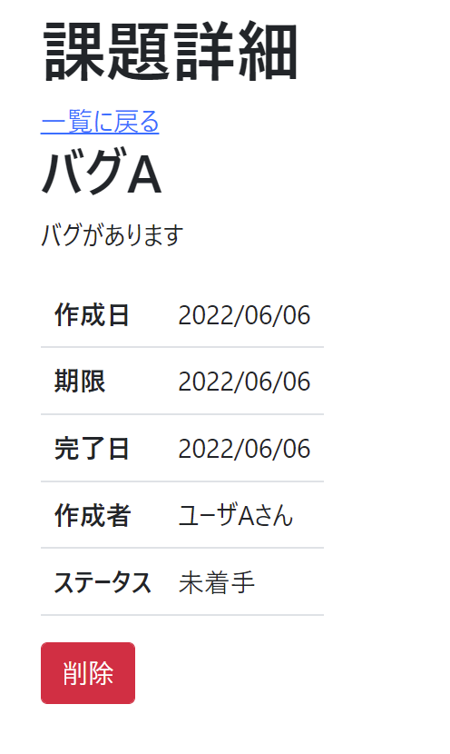
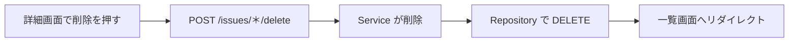

# 課題05：削除機能の追加

| 項目 | 内容 |
|------|------|
| 難易度 | ★★★★★☆（5/6） |
| 重要度 | ★★★★☆☆（4/6） |
| 前提課題 | なし（詳細画面が動いていればOK） |
| 学習項目 | 削除ロジック・POSTによる処理・リダイレクト |
| 修正対象 | `IssueController.java` / `IssueService.java` / `IssueRepository.java` / `detail.html` |

---

## 🎯 背景・目的

不要になった課題を消せるように、**削除機能**を追加します。
詳細画面に「削除」ボタンを置き、押すとその課題を削除して一覧画面に戻る、という一連の流れを作ります。

データを変更する操作なので、**POST メソッド**で処理する点がポイントです。

---

## 📋 やること（仕様）

- 詳細画面に「削除」ボタンを追加する
- ボタン押下時に、その課題を削除して **一覧画面へ遷移**する

### 🖼 完成イメージ

---

## 📁 修正対象ファイル

| ファイル | 修正内容 |
|----------|----------|
| `src/main/resources/templates/issues/detail.html` | 「削除」ボタン（POST送信フォーム）を追加 |
| `src/main/java/com/example/its/web/issue/IssueController.java` | 削除リクエストを受け取り、一覧へリダイレクト |
| `src/main/java/com/example/its/domain/issue/IssueService.java` | 削除処理を呼び出す |
| `src/main/java/com/example/its/domain/issue/IssueRepository.java` | IDを指定して DELETE する |

---

## 🔁 処理の流れ

---

## ✅ 動作確認

- [ ] 詳細画面に「削除」ボタンが表示される
- [ ] 削除すると一覧画面に遷移し、その課題が消えている

---

## 💡 ヒント

削除はなぜ POST？

データを変更・削除する操作は、`<a>` リンク（GET）ではなく `<form>` の **POST** で送るのが基本です。`detail.html` に削除用の `<form>` を作り、送信先を削除用URLにします。

削除後の遷移

削除処理が終わったら、コントローラーで一覧画面へ **リダイレクト**します（`return "redirect:/issues";`）。

---

⬅️ [04 作成に項目を追加](04_create-add-fields.md) ／ 🏠 [課題一覧](README.md) ／ ➡️ [06 変更画面への遷移](06_edit-navigation.md)

> 🔗 この削除に「本当に削除しますか？」の確認をつける課題が [18 確認ダイアログ（簡易）](18_confirm-dialog-simple.md) / [19 確認ダイアログ（リッチ）](19_confirm-dialog-modal.md) です。
