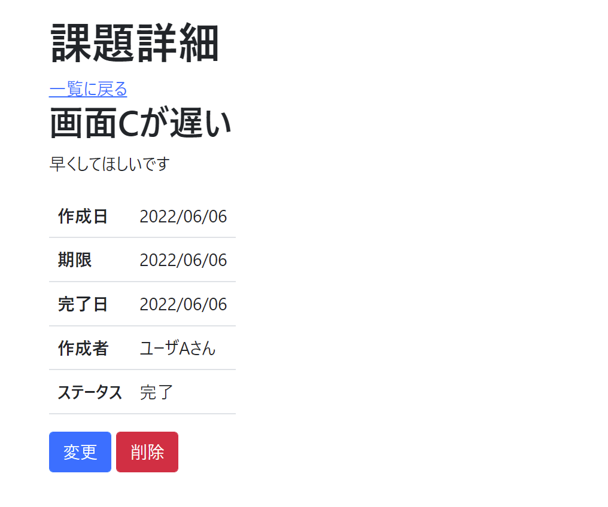
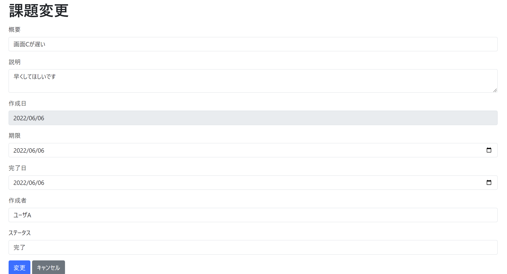

# 課題06：変更画面への遷移

| 項目 | 内容 |
|------|------|
| 難易度 | ★★★★★☆（5/6） |
| 重要度 | ★★★★☆☆（4/6） |
| 前提課題 | [03 詳細に項目を追加](03_detail-add-columns.md) |
| 学習項目 | 画面遷移・既存値のフォーム設定・PathVariable |
| 修正対象 | `IssueChangeForm.java` / `IssueController.java` / `detail.html` / `changeForm.html` |

---

## 🎯 背景・目的

課題を編集できるようにする第一歩として、まずは **変更画面への遷移**だけを作ります。
（実際にDBを更新する処理は次の [課題07](07_edit-feature.md) で実装します。）

詳細画面の「変更」ボタンから変更画面へ移動し、変更画面には **現在の値があらかじめ入力された状態**で表示されるようにします。

---

## 📋 やること（仕様）

- 詳細画面で「変更」を押すと、**変更画面に遷移**する
- 変更画面で「キャンセル」を押すと、**詳細画面に戻る**
- 変更画面のURLは **`/issues/{issueId}/change`** とする

### 🖼 完成イメージ

| 詳細画面（変更ボタン） | 変更画面（現在値が入った状態） |
|:---:|:---:|
|  |  |

---

## 📁 修正対象ファイル

| ファイル | 修正内容 |
|----------|----------|
| `src/main/java/com/example/its/web/issue/IssueChangeForm.java`（新規） | 変更画面用のフォームクラス |
| `src/main/java/com/example/its/web/issue/IssueController.java` | 変更画面表示（GET `/issues/{issueId}/change`） |
| `src/main/resources/templates/issues/detail.html` | 「変更」リンクを追加 |
| `src/main/resources/templates/issues/changeForm.html`（新規） | 変更画面のテンプレート |

---

## ✅ 動作確認

- [ ] 詳細画面から変更画面へ遷移でき、課題情報が**入力済み**で表示される
- [ ] 変更画面の「キャンセル」で元の詳細画面へ戻れる
- [ ] 変更画面のURLが `/issues/{issueId}/change` になっている

---

## 💡 ヒント

実装方法はいくつもありますが、ここではラクな方法を紹介します。

<details>
<summary>変更画面に「現在の値」を表示するには？</summary>

`IssueController` で、変更画面を表示する前に **フォーム（`IssueChangeForm`）に現在の値を設定**しておく必要があります。

そのためには、**DBからデータを再取得して** フォームにセットする方法が簡単です。

```java
// 取得した issue の値を form にセットしてから変更画面を返す
form.setSummary(issue.getSummary());
// …他の項目も同様
```

</details>

---

⬅️ [05 削除機能の追加](05_delete-feature.md) ／ 🏠 [課題一覧](README.md) ／ ➡️ [07 変更機能の追加](07_edit-feature.md)

> ⚡ 「変更画面のたびにDBから再取得」している部分は、[課題20 セッションによるデータ管理](20_session.md) で性能改善します。
