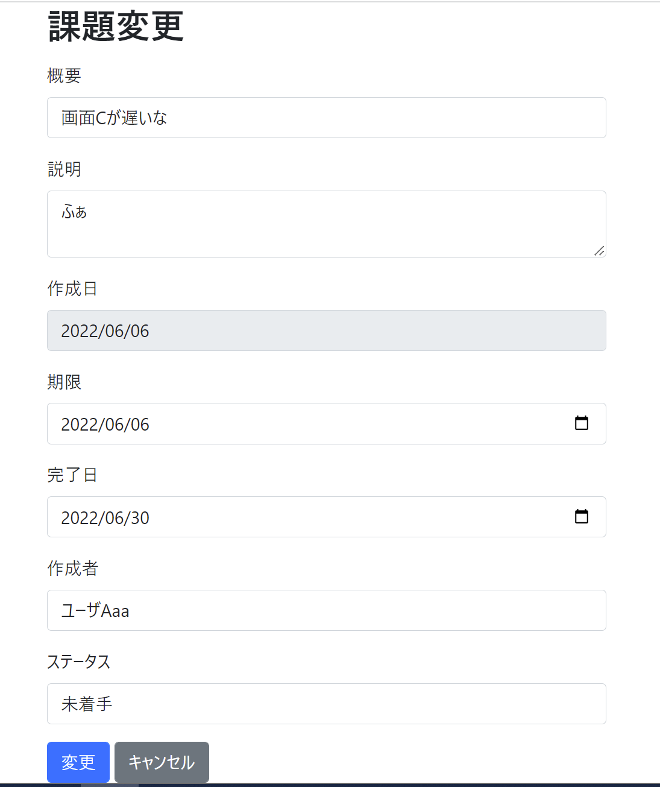

# 課題07：変更機能の追加

| 項目 | 内容 |
|------|------|
| 難易度 | ★★★★★☆（5/6） |
| 重要度 | ★★★★☆☆（4/6） |
| 前提課題 | [06 変更画面への遷移](06_edit-navigation.md) |
| 学習項目 | 更新ロジック・バリデーション・リダイレクト |
| 修正対象 | `IssueController.java` / `IssueService.java` / `IssueRepository.java` |

---

## 🎯 背景・目的

課題06で変更画面まで遷移できるようになりました。
この課題では、変更画面の「変更」ボタンで **実際にDBを更新**し、詳細画面に戻るところまで実装します。これでCRUD（作成・参照・更新・削除）が一通り揃います。

---

## 📋 やること（仕様）

- 変更画面で「変更」を押すと、入力内容で課題を**更新**し、**詳細画面に遷移**する
- 入力誤り（バリデーションエラー）の場合は、変更画面にとどまりエラーを表示する

### 🖼 完成イメージ



---

## 📁 修正対象ファイル

| ファイル | 修正内容 |
|----------|----------|
| `src/main/java/com/example/its/web/issue/IssueController.java` | 変更リクエスト（POST `/issues/{issueId}/change`）を受け取り更新 |
| `src/main/java/com/example/its/domain/issue/IssueService.java` | 更新処理 `change(...)` |
| `src/main/java/com/example/its/domain/issue/IssueRepository.java` | `UPDATE` 文 |

---

## ✅ 動作確認

- [ ] 課題の変更ができる（更新後、詳細画面に反映される）
- [ ] 入力誤り（必須項目を空にするなど）で業務エラーが正しく動作する

---

## 💡 ヒント

<details>
<summary>更新後の遷移</summary>

更新が成功したら詳細画面へリダイレクトします。`{issueId}` を含むURLにリダイレクトする書き方に注意しましょう。

```java
return "redirect:/issues/{issueId}";
```

</details>

<details>
<summary>バリデーションエラー時</summary>

`BindingResult` にエラーがある場合は更新せず、変更画面を再表示します。このとき入力値が消えないように注意します。

</details>

---

⬅️ [06 変更画面への遷移](06_edit-navigation.md) ／ 🏠 [課題一覧](README.md) ／ ➡️ [08 課題がない場合の業務エラー](08_not-found-error.md)
