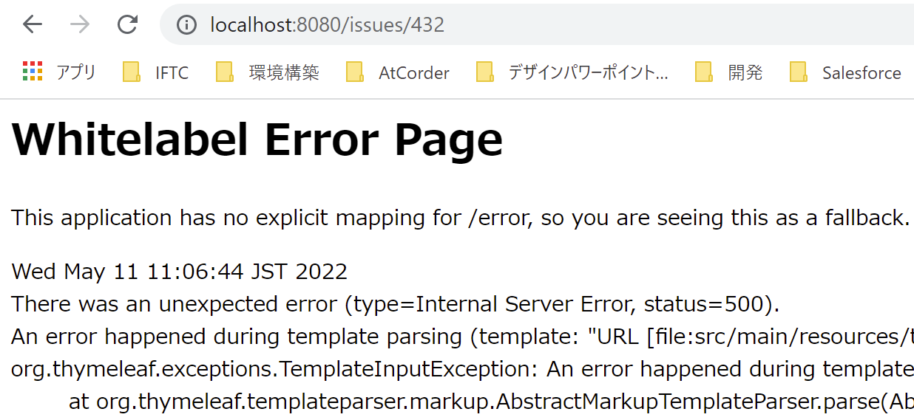
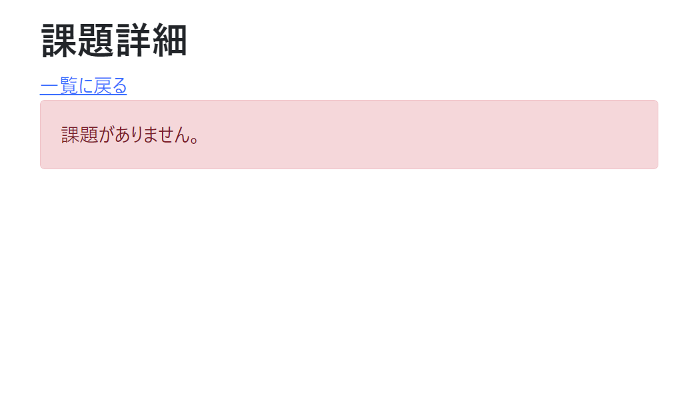
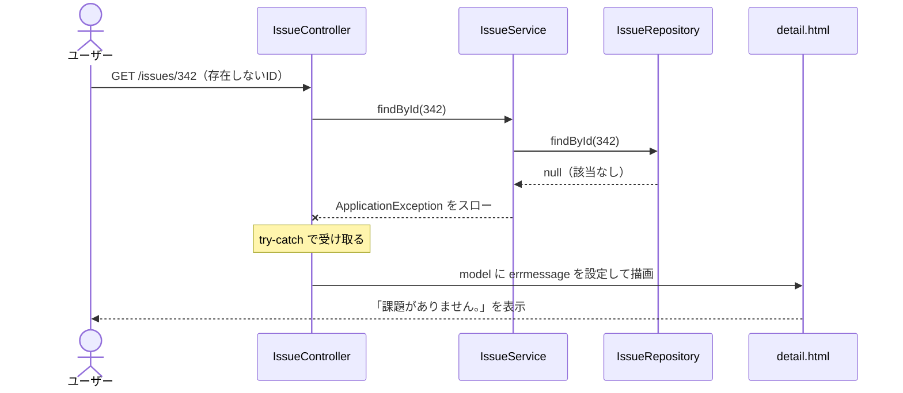

# 課題08：課題がない場合の業務エラー 🎓

| 項目 | 内容 |
|------|------|
| 難易度 | ★★★☆☆☆（3/6） |
| 重要度 | ★★★★★★（6/6） |
| 前提課題 | なし（詳細画面が動いていればOK） |
| 学習項目 | 業務エラー処理・独自例外・例外ハンドリング |
| 修正対象 | `ApplicationException.java` / `IssueService.java` / `IssueController.java` / `detail.html` |

> 🎓 この課題は重要度が最高（6/6）です。実務で頻出する「業務エラーをどう扱うか」の考え方を学びます。

---

## 🎯 背景・現在の仕様の問題

現在、**存在しない課題ID**で詳細画面のURLに直接アクセスすると、Spring のデフォルトエラー画面（Whitelabel Error Page）が表示されてしまいます。



これには次のような問題があります。

- ❌ ユーザーが**URLを直接入力／ブックマークから遷移**するケースを考慮していない
- ❌ **複数ユーザーが同時に使用**していて、片方が課題を削除した直後にもう片方が開く、といったケースを考慮していない

技術的なエラー画面ではなく、**「課題がありません」とユーザーにわかる形**で伝えるべきです。

---

## 📋 やること（仕様）

存在しない課題IDでアクセスされたとき、詳細画面に下記のようなメッセージを表示します。

### 🖼 完成イメージ



---

## 🧭 処理の流れ（設計）

「データがなければ独自例外を投げ、コントローラーで受け取って画面にメッセージを渡す」という流れを作ります。



---

## 📁 修正対象ファイル

| ファイル | 修正内容 |
|----------|----------|
| `src/main/java/com/example/its/exception/ApplicationException.java` | メッセージを持てる独自例外クラス |
| `src/main/java/com/example/its/domain/issue/IssueService.java` | 課題が `null` のとき独自例外をスロー |
| `src/main/java/com/example/its/web/issue/IssueController.java` | 例外を `try-catch` し、メッセージを `model` に設定 |
| `src/main/resources/templates/issues/detail.html` | メッセージの有無で表示を分岐 |

### 実装方針

1. **独自例外クラス**（`ApplicationException`）にメッセージを持たせられるようにする
2. **業務処理**（`IssueService`）で課題が見つからなければ、独自例外にメッセージを設定してスローする
3. ②でスローした例外を**コントローラー**（`IssueController`）でキャッチし、メッセージを `model` に設定する
4. **ビュー**（`detail.html`）で、メッセージがある場合とない場合で分岐して画面を描画する

---

## ✅ 動作確認

- [ ] 通常の詳細画面が表示できる（例：<http://localhost:8080/issues/1>）
- [ ] 存在しない課題（<http://localhost:8080/issues/342>）に遷移すると、エラーメッセージが表示される
- [ ] Whitelabel Error Page が表示されない

---

## 💡 ヒント

<details>
<summary>独自例外でメッセージを運ぶには？</summary>

`Exception` を継承した独自例外クラスを作り、コンストラクタでメッセージを受け取って `super(message)` に渡すと、`getMessage()` でメッセージを取り出せます。

</details>

<details>
<summary>ビュー側で分岐するには？</summary>

Thymeleaf の `th:if` を使い、`errmessage` があるときはエラー表示、ないときは通常の詳細を表示するように分けます。Bootstrap の `alert alert-danger` クラスを使うと、画像のような赤いメッセージボックスになります。

```html
<div th:if="${errmessage}" class="alert alert-danger" role="alert" th:text="${errmessage}"></div>
<div th:if="!${errmessage}">
    <!-- 通常の詳細表示 -->
</div>
```

</details>

---

## 🔗 関連課題

このあと [09 メッセージの共通化](09_externalize-messages.md) で、ここでコードに直接書いたエラーメッセージを**外部ファイルに切り出す**リファクタリングを行います。

➡️ 次の課題：[09 メッセージの共通化](09_externalize-messages.md)
