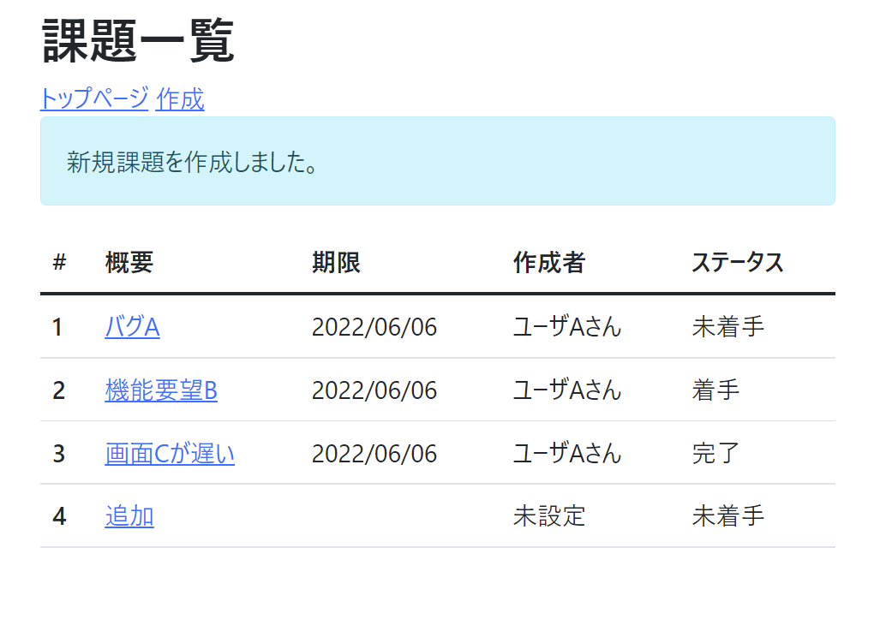

# 課題10：作成完了メッセージの表示

| 項目 | 内容 |
|------|------|
| 難易度 | ★☆☆☆☆☆（1/6） |
| 重要度 | ★★★☆☆☆（3/6） |
| 前提課題 | なし（課題の作成が動いていればOK） |
| 学習項目 | リダイレクトとリクエストパラメータ |
| 修正対象 | `IssueController.java` / `list.html` |

---

## 🎯 背景・目的

課題を作成したあと、一覧画面に戻っても「ちゃんと登録できたのか」がわかりません。
そこで、**作成が成功したときだけ**一覧画面に「新規課題を作成しました。」というメッセージを表示します。

ポイントは、作成後は一覧画面に **リダイレクト**しているため、`model` で値を渡せないこと。そこで **URLのリクエストパラメータ**を使ってメッセージ表示の合図を送ります。

---

## 📋 やること（仕様）

- 課題作成が成功したら、一覧画面に「新規課題を作成しました。」と表示する
- 通常の一覧表示（作成直後でない場合）はメッセージを表示しない

### 🖼 完成イメージ



---

## 📁 修正対象ファイル

| ファイル | 修正内容 |
|----------|----------|
| `src/main/java/com/example/its/web/issue/IssueController.java` | リダイレクト時にリクエストパラメータを付与 |
| `src/main/resources/templates/issues/list.html` | パラメータがあるときだけメッセージを表示 |

---

## ✅ 動作確認

- [ ] 通常の一覧画面ではメッセージが表示されない
- [ ] 課題を登録すると、一覧画面で「新規課題を作成しました。」が表示される

---

## 💡 ヒント

<details>
<summary>① リダイレクト時にパラメータを付ける（IssueController）</summary>

リダイレクト先URLの末尾にパラメータ（例：`created`）を付けます。

```java
return "redirect:/issues?created";
```

すると、ブラウザは `localhost:8080/issues?created` に遷移します。

</details>

<details>
<summary>② パラメータがあるときだけ表示する（list.html）</summary>

Thymeleaf では `${param.xxx}` でリクエストパラメータの有無を判定できます。

```html
<div th:if="${param.created}" class="alert alert-info">新規課題を作成しました。</div>
```

</details>

---

⬅️ [09 メッセージの共通化](09_externalize-messages.md) ／ 🏠 [課題一覧](README.md) ／ ➡️ [11 完了メッセージの共通化](11_externalize-success-message.md)

> 🔗 ここで直書きしたメッセージは、次の [課題11](11_externalize-success-message.md) で外部ファイルに共通化します。
