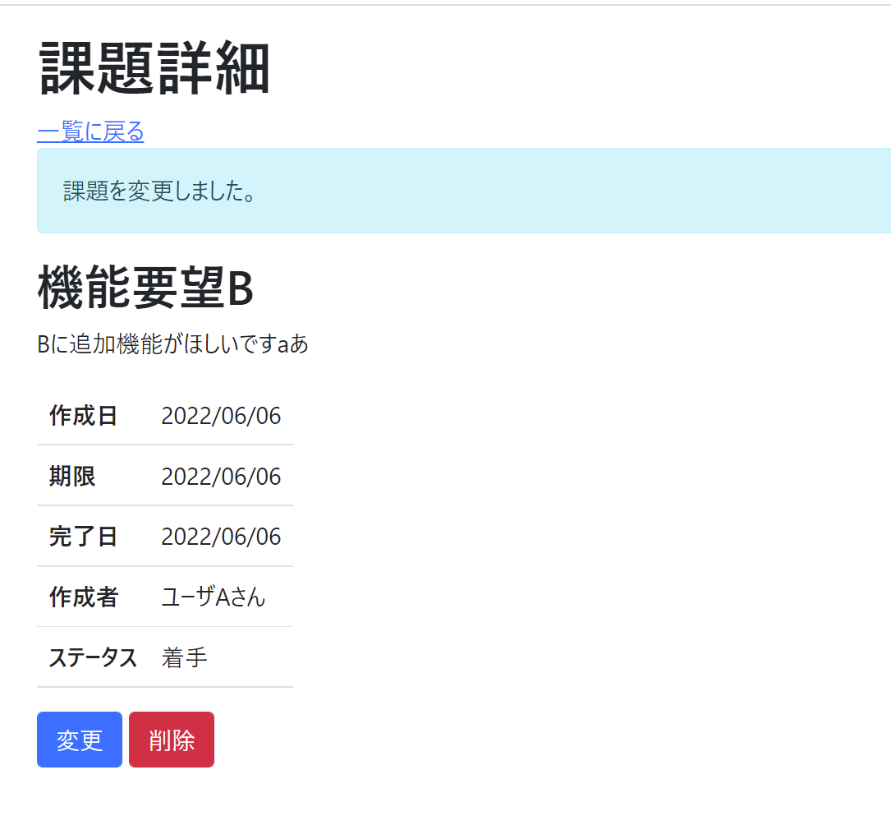

# 課題12：変更完了メッセージの表示

| 項目 | 内容 |
|------|------|
| 難易度 | ★☆☆☆☆☆（1/6） |
| 重要度 | ★★☆☆☆☆（2/6） |
| 前提課題 | [07 変更機能の追加](07_edit-feature.md)・[11 完了メッセージの共通化](11_externalize-success-message.md) |
| 学習項目 | リダイレクトとリクエストパラメータ（応用） |
| 修正対象 | `IssueController.java` / `detail.html` |

---

## 🎯 背景・目的

課題10では「作成」完了メッセージを表示しました。今度は **「変更」完了メッセージ**です。
変更が成功したら、遷移先の **詳細画面**に「課題を変更しました。」と表示します。

課題10・11と同じ考え方（リダイレクト＋リクエストパラメータ＋メッセージの外部ファイル化）の復習になります。

---

## 📋 やること（仕様）

- 変更が成功したら、詳細画面に「課題を変更しました。」と表示する

### 🖼 完成イメージ



---

## 📁 修正対象ファイル

| ファイル | 修正内容 |
|----------|----------|
| `src/main/java/com/example/its/web/issue/IssueController.java` | 更新後、詳細画面へリダイレクトする際にパラメータを付与 |
| `src/main/resources/templates/issues/detail.html` | パラメータがあるときだけメッセージを表示 |

---

## ✅ 動作確認

- [ ] 変更すると、遷移先の詳細画面で「課題を変更しました。」が表示される
- [ ] 通常の詳細表示ではメッセージが表示されない

---

## 💡 ヒント

<details>
<summary>考え方</summary>

課題10と同じく、リダイレクトURLにパラメータ（例：`changed`）を付け、詳細画面側で `${param.changed}` の有無で分岐します。メッセージ文言は課題11と同様に `messages.properties` から参照しましょう。

```java
return "redirect:/issues/{issueId}?changed";
```

</details>

---

⬅️ [11 完了メッセージの共通化](11_externalize-success-message.md) ／ 🏠 [課題一覧](README.md) ／ ➡️ [13 バリデーションメッセージの変更](13_custom-validation-message.md)
