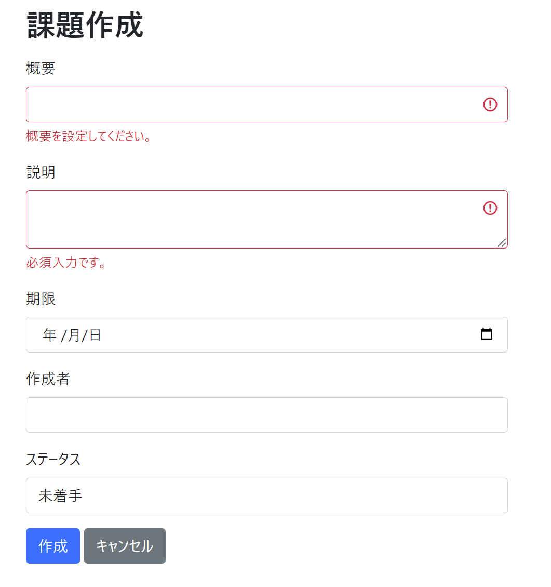

# 課題13：バリデーションメッセージの変更

| 項目 | 内容 |
|------|------|
| 難易度 | ★☆☆☆☆☆（1/6） |
| 重要度 | ★★★★★★（6/6） |
| 前提課題 | [09 メッセージの共通化](09_externalize-messages.md) |
| 学習項目 | バリデーションメッセージのカスタマイズ |
| 修正対象 | `messages.properties` |

> 🎓 重要度は最高（6/6）。ユーザーに伝わるエラー表示は実務で非常に重要です。

---

## 🎯 背景・目的

入力チェック（バリデーション）に引っかかると、初期状態では英語まじりの定型メッセージが表示されます。
これを **アプリ独自の、日本語でわかりやすいメッセージ**に変更します。

しかも、`messages.properties` に書くだけで（＝Javaコードを触らずに）変更できる、という点を体験します。

---

## 📋 やること（仕様）

バリデーションエラー時のメッセージを、オリジナルの文言に設定します。

### 🖼 完成イメージ



---

## 📁 修正対象ファイル

| ファイル | 修正内容 |
|----------|----------|
| `src/main/resources/messages.properties` | バリデーションメッセージのキー＝値を追加 |

---

## ✅ 動作確認

- [ ] 作成画面で未入力のまま作成しようとすると、独自のエラーメッセージが表示される

---

## 💡 ヒント

書き方は大きく2通りあります（代表的な2例を紹介）。

<details>
<summary>① そのアノテーションのメッセージを「すべて」変える</summary>

`アノテーション名=メッセージ` の形で書くと、その種類のエラー全体に適用されます。

```properties
NotBlank=必須入力です。
```

</details>

<details>
<summary>② 特定の項目だけ変える</summary>

`アノテーション名.フォーム名.項目名=メッセージ` の形で、ピンポイントに指定できます。

```properties
NotBlank.issueForm.summary=概要を設定してください。
```

</details>

> ⚠️ **注意：** フォーム名は `IssueForm` ではなく **先頭小文字の `issueForm`** と書きます。ここを間違えると効きません。

---

⬅️ [12 変更完了メッセージの表示](12_edit-success-message.md) ／ 🏠 [課題一覧](README.md) ／ ➡️ [14 相関チェックの実装](14_correlation-validation.md)
