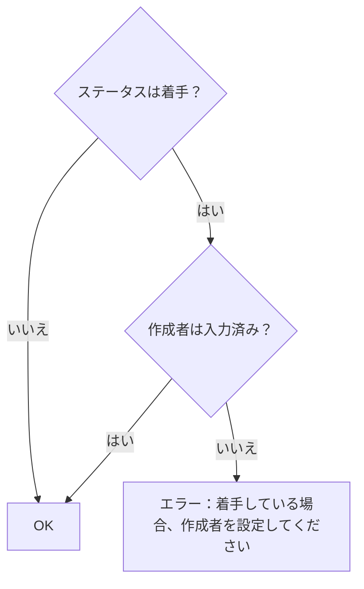
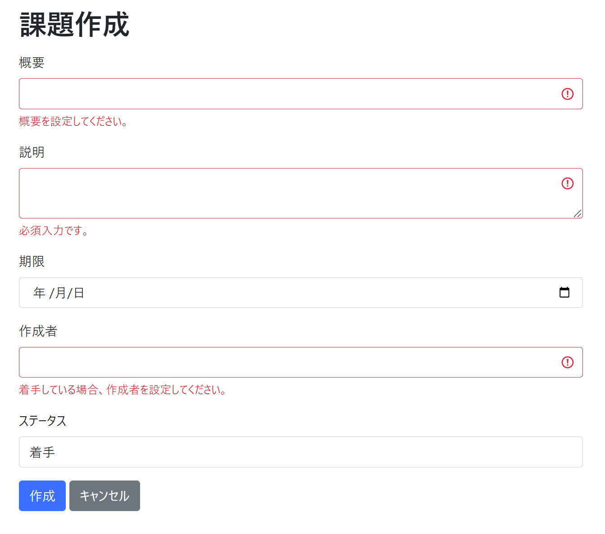

# 課題14：相関チェックの実装

| 項目 | 内容 |
|------|------|
| 難易度 | ★★★☆☆☆（3/6） |
| 重要度 | ★★★★★☆（5/6） |
| 前提課題 | [04 作成に項目を追加](04_create-add-fields.md)・[13 バリデーションメッセージの変更](13_custom-validation-message.md) |
| 学習項目 | 相関チェック（複数項目をまたぐバリデーション） |
| 修正対象 | `IssueForm.java` / `creationForm.html` / `messages.properties` |

---

## 🎯 背景・目的

これまでのバリデーションは「概要は必須」のように **1項目だけ**のチェックでした。
実務では「**ある項目の値によって、別の項目の必須が変わる**」という**相関チェック**がよく登場します。

ここでは「ステータスが『着手』なのに作成者が空」を不正としてはじきます。

---

## 📋 やること（仕様）

作成画面で **ステータスが「着手」のときは、作成者の入力を必須**にします。

### 判定ルール



### 🖼 完成イメージ



---

## 📁 修正対象ファイル

| ファイル | 修正内容 |
|----------|----------|
| `src/main/java/com/example/its/web/issue/IssueForm.java` | 複数項目をまたぐチェックメソッドを追加 |
| `src/main/resources/templates/issues/creationForm.html` | 相関チェックのエラーを表示 |
| `src/main/resources/messages.properties` | エラーメッセージを定義 |

---

## ✅ 動作確認

- [ ] ステータス「着手」かつ作成者が空のとき、エラーメッセージが表示される
- [ ] ステータス「着手」でも作成者が入力されていれば登録できる
- [ ] ステータスが「着手」以外なら、作成者が空でも登録できる

---

## 💡 ヒント

<details>
<summary>複数項目をまたぐチェックは？</summary>

`IssueForm` に **`boolean` を返すメソッド**を作り、`@AssertTrue` を付けます。`true` を返せばOK、`false` でエラーになります。「ステータスが着手 **かつ** 作成者が空」のときに `false`（不正）を返すように書きます。

</details>

<details>
<summary>メッセージの定義（ネタバレ注意）</summary>

`@AssertTrue` を付けたメソッド名（例：`nocreateuser`）に対応するキーで、`messages.properties` にメッセージを書きます。

```properties
NotBlank=必須入力です。
NotBlank.issueForm.summary=概要を設定してください。
AssertTrue.issueForm.nocreateuser=着手している場合、作成者を設定してください。
```

</details>

---

⬅️ [13 バリデーションメッセージの変更](13_custom-validation-message.md) ／ 🏠 [課題一覧](README.md) ／ ➡️ [15 簡易業務仕様の追加](15_auto-completion-date.md)
