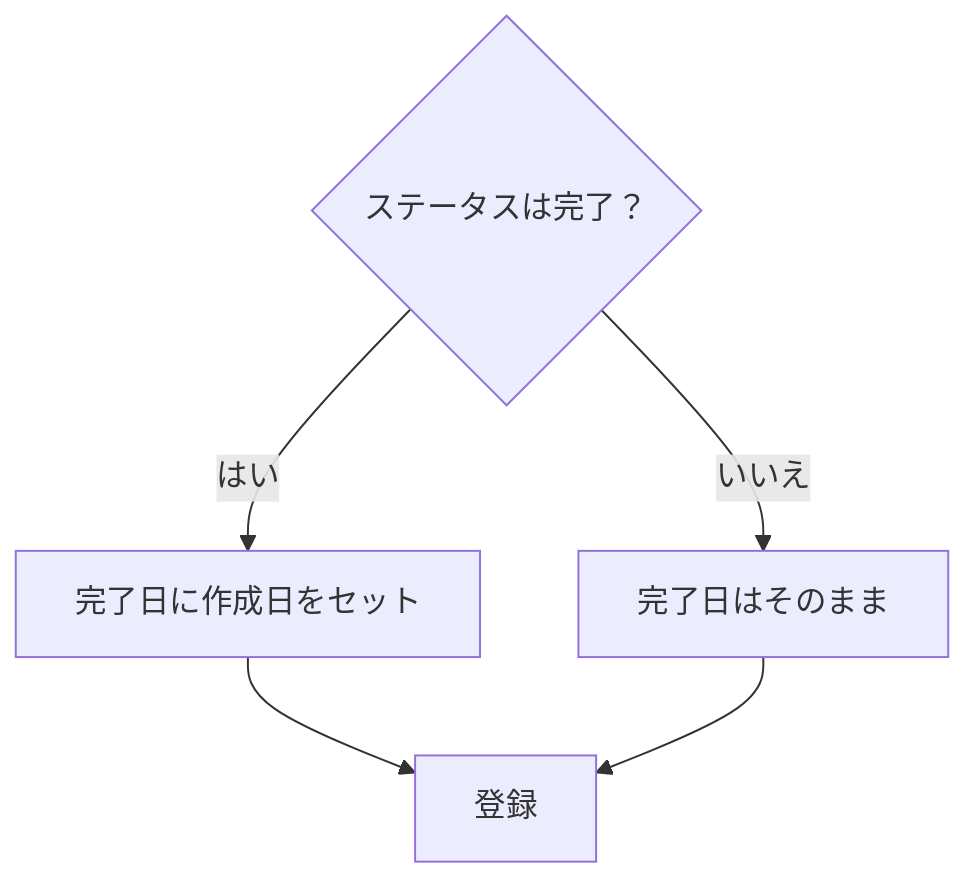

# 課題15：簡易業務仕様の追加（完了日の自動入力）

| 項目 | 内容 |
|------|------|
| 難易度 | ★★☆☆☆☆（2/6） |
| 重要度 | ★★☆☆☆☆（2/6） |
| 前提課題 | [04 作成に項目を追加](04_create-add-fields.md) |
| 学習項目 | 業務ロジックの実装 |
| 修正対象 | `IssueService.java` / `IssueRepository.java` |

---

## 🎯 背景・目的

「完了した課題には完了日が入っているべき」——こうした **業務上のルール（業務仕様）** をアプリに組み込みます。

ここでは「作成時にステータスが『完了』なら、完了日を自動でセットする」という小さな業務ロジックを実装します。入力に頼らず、**業務ロジック層で値を補う**という考え方を学びます。

---

## 📋 やること（仕様）

作成画面で **ステータスが「完了」で登録した場合、完了日に作成日（登録日）を自動で入力**します。

---

## 📁 修正対象ファイル

| ファイル | 修正内容 |
|----------|----------|
| `src/main/java/com/example/its/domain/issue/IssueService.java` | 作成処理でステータスを判定し、完了日をセット |
| `src/main/java/com/example/its/domain/issue/IssueRepository.java` | `insert` に完了日を渡す |

---

## ✅ 動作確認

- [ ] 作成画面でステータス「完了」を選んで登録できる
- [ ] 上記で登録した課題の詳細画面で、完了日が入力されている

---

## 💡 ヒント

どこに書く？

画面（HTML）やコントローラーではなく、**業務ロジック（`IssueService`）の作成処理**の中で判定します。「ステータス == 完了」なら完了日に現在日付（作成日）を設定してから登録します。

---

⬅️ [14 相関チェックの実装](14_correlation-validation.md) ／ 🏠 [課題一覧](README.md) ／ ➡️ [16 CSSの追加](16_css.md)
