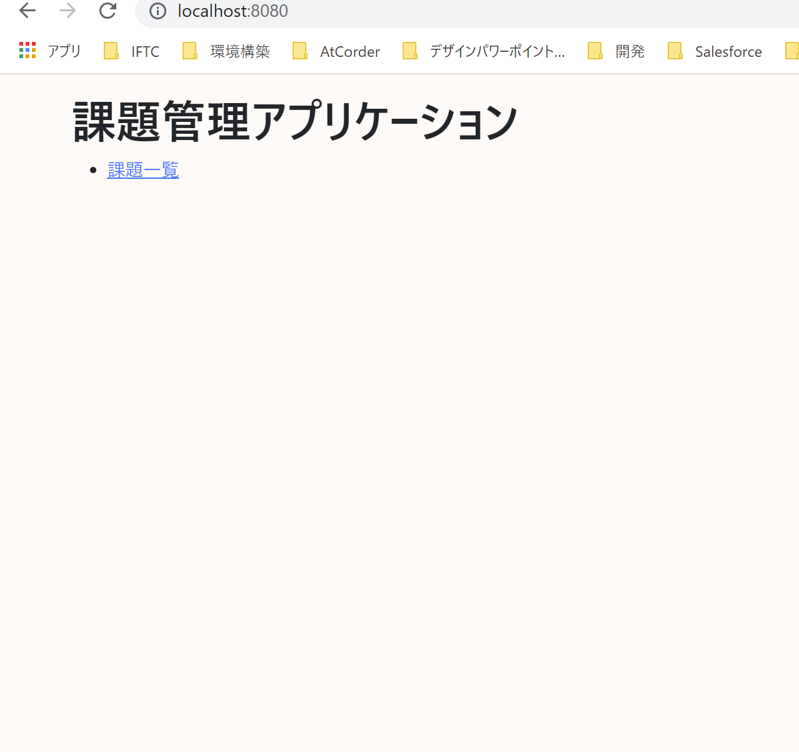

# 課題16：CSSの追加

| 項目 | 内容 |
|------|------|
| 難易度 | ★☆☆☆☆☆（1/6） |
| 重要度 | ★★★☆☆☆（3/6） |
| 前提課題 | なし |
| 学習項目 | CSSの追加・静的リソース・共通レイアウト |
| 修正対象 | `main.css`（新規） / `layout.html` |

---

## 🎯 背景・目的

見た目を整えるために、独自の **CSS** を追加します。
ここでは題材として **背景色を変更**します。CSSファイルを作り、共通レイアウト（`layout.html`）から読み込ませることで、**全画面に一括で**スタイルを適用できることを学びます。

---

## 📋 やること（仕様）

- 独自のCSSファイルを追加し、画面の **背景色を変更**する

### 🖼 完成イメージ



---

## 📁 修正対象ファイル

| ファイル | 修正内容 |
|----------|----------|
| `src/main/resources/static/main.css`（新規） | 背景色などのスタイルを定義 |
| `src/main/resources/templates/fragments/layout.html` | `main.css` を読み込む |

> ℹ️ `src/main/resources/static` 配下に置いたファイルは、`/main.css` のようなURLで配信されます。共通レイアウト（`layout.html`）で読み込めば、全ページに反映されます。

---

## ✅ 動作確認

- [ ] 画面の見た目（背景色）が変わっている
- [ ] 一覧・詳細・作成など、各画面に反映されている

---

## 💡 ヒント

<details>
<summary>CSSの読み込み方</summary>

`layout.html` の `<head>` に、Thymeleaf のリンクで `main.css` を読み込みます。

```html
<link rel="stylesheet" th:href="@{/main.css}">
```

`main.css` 側で `body { background-color: ...; }` のように背景色を指定します。

</details>

---

⬅️ [15 簡易業務仕様の追加](15_auto-completion-date.md) ／ 🏠 [課題一覧](README.md) ／ ➡️ [17 ファビコンの設定](17_favicon.md)
