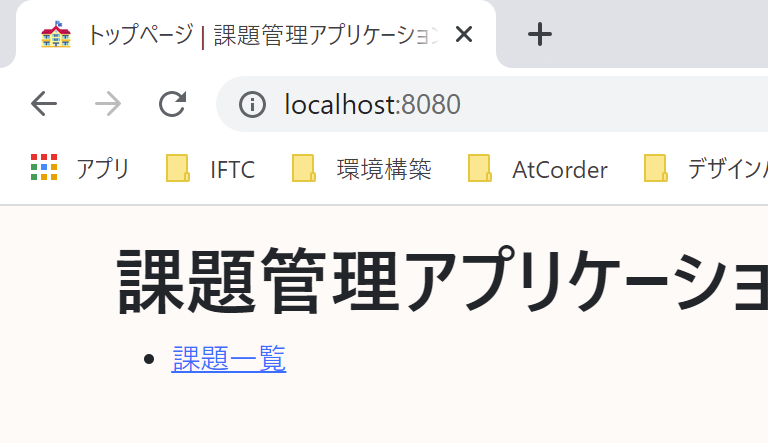

# 課題17：ファビコンの設定

| 項目 | 内容 |
|------|------|
| 難易度 | ★☆☆☆☆☆（1/6） |
| 重要度 | ★☆☆☆☆☆（1/6） |
| 前提課題 | なし |
| 学習項目 | ファビコン・静的リソース |
| 修正対象 | `favicon.ico`（新規） |

---

## 🎯 背景・目的

ブラウザのタブに表示される小さなアイコン（**ファビコン**）を設定します。
ちょっとした仕上げですが、アプリらしさが出ます。静的リソースの配置だけで完結する、いちばん手軽な課題です。

---

## 📋 やること（仕様）

- 任意のファビコンを設定し、ブラウザのタブにアイコンを表示する

### 🖼 完成イメージ

---

## 📁 修正対象ファイル

| ファイル | 修正内容 |
|----------|----------|
| `src/main/resources/static/favicon.ico`（新規） | 好きなアイコン画像（`.ico`）を配置 |

> ℹ️ Spring Boot は `static` 直下の `favicon.ico` を自動的にファビコンとして扱います。基本は **ファイルを置くだけ**です。

---

## ✅ 動作確認

- [ ] ブラウザのタブにファビコンが表示される

---

## 💡 ヒント

.ico ファイルの用意

好きな画像を `.ico` 形式に変換して `favicon.ico` という名前で `static` 直下に置きます。反映されないときは、ブラウザのキャッシュをクリア（スーパーリロード）してみましょう。

---

⬅️ [16 CSSの追加](16_css.md) ／ 🏠 [課題一覧](README.md) ／ ➡️ [18 確認ダイアログの表示（簡易）](18_confirm-dialog-simple.md)
