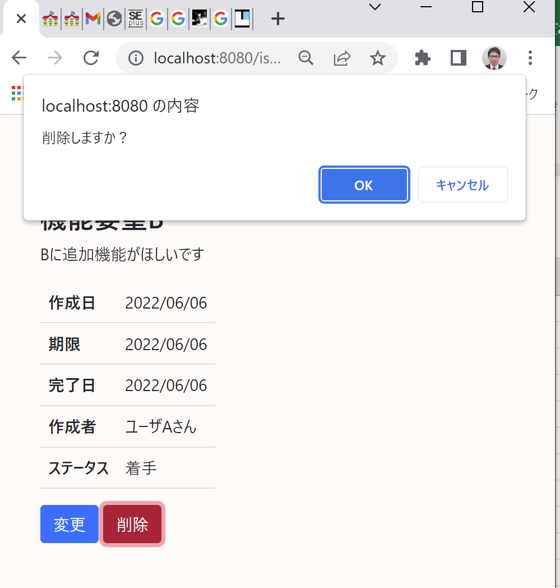

# 課題18：確認ダイアログの表示（簡易）

| 項目 | 内容 |
|------|------|
| 難易度 | ★☆☆☆☆☆（1/6） |
| 重要度 | ★★☆☆☆☆（2/6） |
| 前提課題 | [05 削除機能の追加](05_delete-feature.md) |
| 学習項目 | JavaScript の直接記述・`onsubmit`・`confirm` |
| 修正対象 | `detail.html` |

---

## 🎯 背景・目的

削除はやり直しがきかない操作です。誤操作を防ぐため、削除前に **「削除しますか？」という確認ダイアログ**を出します。

まずは一番シンプルに、ブラウザ標準の `confirm()` を使った方法で実装します。

---

## 📋 やること（仕様）

- 削除ボタンを押したとき、確認ダイアログを表示する
- 「OK」なら削除、「キャンセル」なら何もしない（元の画面のまま）

### 🖼 完成イメージ



---

## 📁 修正対象ファイル

| ファイル | 修正内容 |
|----------|----------|
| `src/main/resources/templates/issues/detail.html` | 削除フォームに確認処理を追加 |

---

## ✅ 動作確認

- [ ] 確認ダイアログで「OK」を押すと削除できる
- [ ] 確認ダイアログで「キャンセル」を押すと、削除されず元の画面に戻る

---

## 📝 解説

この課題で使う仕組みは次の3つです。

- **`form` の `onsubmit` 属性**：ボタン押下（フォーム送信）時に実行されるJavaScript
- `onsubmit` の中で **`false` が返されると、送信（submit）がキャンセル**される
- **`confirm(メッセージ)`**：確認ダイアログを表示し、「OK」なら `true`、「キャンセル」なら `false` を返す

つまり「`onsubmit` で `confirm()` の結果を `return` する」だけで、キャンセル時は削除を中断できます。

---

## 💡 ヒント

<details>
<summary>実装のかたち（ネタバレ注意）</summary>

削除用の `<form>` に `onsubmit` を追加します。

```html
<form action="#"
      th:action="@{/issues/{issueId}/delete(issueId=${issueId})}"
      th:method="post" class="d-inline"
      onsubmit="return confirm('削除しますか？')">
```

</details>

---

## 🔗 参考リンク

- [confirm の使い方（JavaScript）](https://www.javadrive.jp/javascript/webpage/index1.html)
- [onsubmit の使い方](https://www.koikikukan.com/archives/2012/01/18-022222.php)

---

⬅️ [17 ファビコンの設定](17_favicon.md) ／ 🏠 [課題一覧](README.md) ／ ➡️ [19 確認ダイアログの表示（リッチ）](19_confirm-dialog-modal.md)
