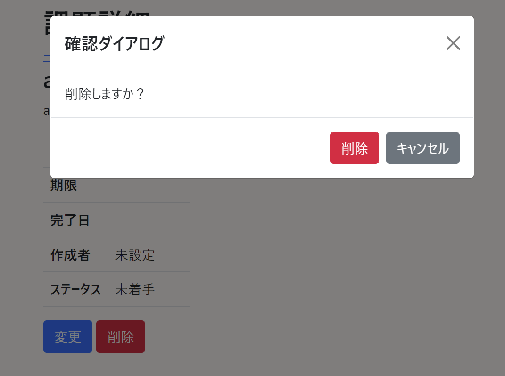

# 課題19：確認ダイアログの表示（リッチ）

| 項目 | 内容 |
|------|------|
| 難易度 | ★★★★☆☆（4/6） |
| 重要度 | ★★☆☆☆☆（2/6） |
| 前提課題 | [05 削除機能の追加](05_delete-feature.md) |
| 学習項目 | Bootstrap モーダル・JavaScriptファイルの分離 |
| 修正対象 | `detail.html` / `main.js`（新規） |

---

## 🎯 背景・目的

[課題18](18_confirm-dialog-simple.md) ではブラウザ標準の `confirm()` を使いました。
見た目を整えたい・アプリのデザインに合わせたい場合は、**Bootstrap のモーダルウィンドウ**で確認ダイアログを作ります。

標準ダイアログとの違い（見た目を自由に作れる／JavaScriptで制御する）を体験する、少し歯ごたえのある課題です。

---

## 📋 やること（仕様）

- 削除ボタンを押すと、**オリジナルのモーダルウィンドウ**で確認を表示する
- モーダルの「削除」で実際に削除する

### 🖼 完成イメージ



---

## 📁 修正対象ファイル

| ファイル | 修正内容 |
|----------|----------|
| `src/main/resources/templates/issues/detail.html` | モーダルのHTMLと、起動用のボタンを配置 |
| `src/main/resources/static/main.js`（新規） | モーダルの「削除」ボタンで削除フォームを送信する処理 |

---

## ✅ 動作確認

- [ ] 削除ボタンでモーダルが表示される
- [ ] モーダルの「削除」で実際に削除できる
- [ ] モーダルの「キャンセル」で閉じて、削除されない

---

## 💡 ヒント

<details>
<summary>進め方</summary>

1. Bootstrap のモーダル（`modal`）を `detail.html` に配置する
2. 削除ボタンを、モーダルを開くトリガーにする（`data-bs-toggle="modal"` など）
3. モーダル内の「削除」ボタンが押されたら、`main.js` で削除フォームを `submit()` する

JavaScriptは `main.js` に分けて、`detail.html` から読み込みます。

```html
<script th:src="@{/main.js}"></script>
```

</details>

---

## 🔗 参考リンク

- [Bootstrap モーダル（公式・日本語）](https://getbootstrap.jp/docs/5.0/components/modal/)

---

⬅️ [18 確認ダイアログの表示（簡易）](18_confirm-dialog-simple.md) ／ 🏠 [課題一覧](README.md) ／ ➡️ [20 セッションによるデータ管理](20_session.md)
