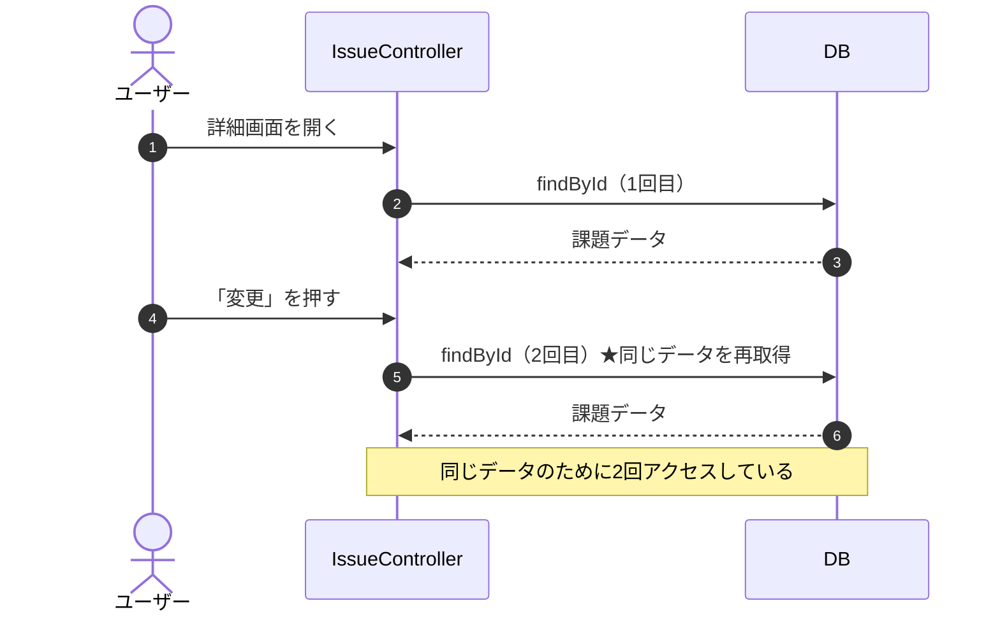
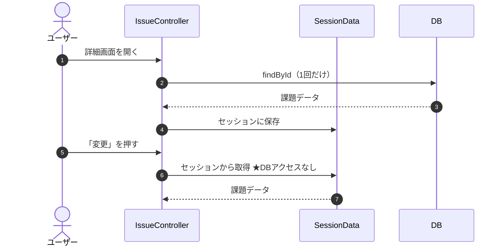
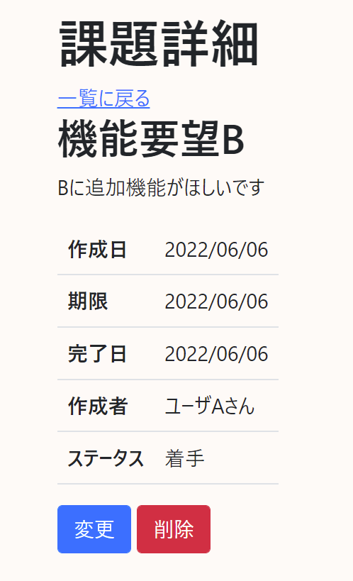
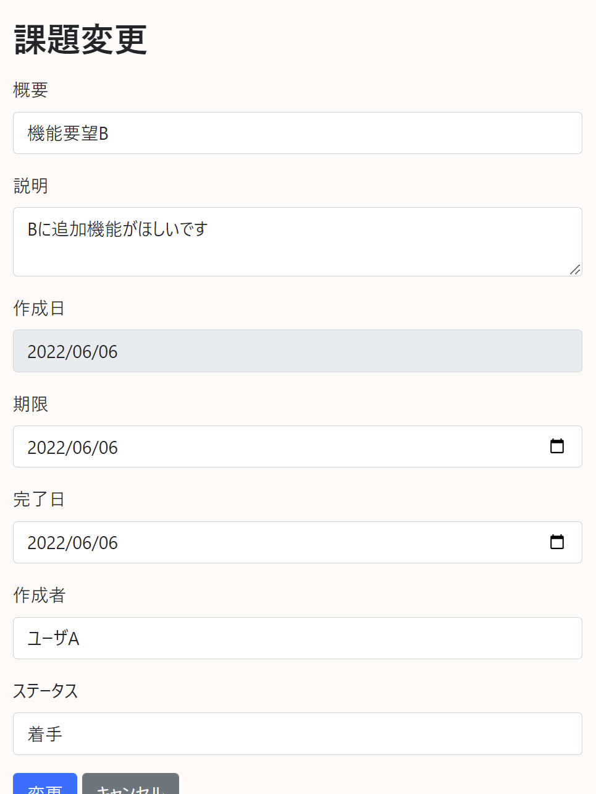

# 課題20：セッションによるデータ管理 🎓

| 項目 | 内容 |
|------|------|
| 難易度 | ★★★★★★（6/6） |
| 重要度 | ★★★★★☆（5/6） |
| 前提課題 | [07 変更機能の追加](07_edit-feature.md) |
| 学習項目 | セッション・`@SessionScope`・性能改善 |
| 修正対象 | `SessionData.java`（新規） / `IssueController.java` / `detail.html` |

> 🎓 この課題集の中で**最難関**です。Webアプリの状態管理（セッション）を理解する応用課題です。

---

## 🎯 背景・現在の仕様の問題

詳細画面から変更画面へ遷移するとき（および変更画面で業務エラーが起きたとき）、**そのたびにDBへアクセスして課題データを取り直しています**。

一度詳細画面で取得したばかりのデータなのに、変更画面でまた同じデータを取りに行くのは**ムダなDBアクセス**であり、性能面で好ましくありません。



---

## 📋 やること（仕様）

**詳細画面で取得した課題データをセッションに格納**し、変更画面へ遷移する際は**DBではなくセッションから取得**するようにします。



### 🖼 画面イメージ（詳細 → 変更）

| 詳細画面（ここでセッションに保存） | 変更画面（セッションから復元） |
|:---:|:---:|
|  |  |

---

## 📁 修正対象ファイル

| ファイル | 修正内容 |
|----------|----------|
| `src/main/java/com/example/its/session/SessionData.java`（新規） | セッションスコープで課題データを保持するクラス |
| `src/main/java/com/example/its/web/issue/IssueController.java` | 詳細表示時にセッションへ保存、変更画面表示時にセッションから取得 |
| `src/main/resources/templates/issues/detail.html` | （必要に応じて）変更リンクの調整 |

新規クラスの配置場所：

```text
src/main/java/com/example/its/session/SessionData.java
```

---

## ✅ 動作確認

- [ ] 詳細画面 → 変更画面の遷移で、課題データが正しく引き継がれて表示される
- [ ] 変更画面への遷移時に**DBアクセスが発生していない**（ログやデバッグで確認）
- [ ] 変更画面で業務エラー（入力誤り）が起きても、データが保持されている

---

## 💡 ヒント

<details>
<summary>セッションにデータを持たせるには？</summary>

Spring では、`@Component` かつ `@SessionScope` を付けたクラスを作ると、**セッション単位で生存するBean**になります。そこに課題データを保持するフィールドと getter/setter を用意し、コントローラーにDI（注入）して使います。

```java
@Component
@SessionScope
public class SessionData {
    // 課題データを保持するフィールド + getter/setter
}
```

</details>

<details>
<summary>どのタイミングで保存／取得する？</summary>

- **保存**：詳細表示（`showDetail`）でDBから取得した直後にセッションへ `set`
- **取得**：変更画面表示（`showChangeForm`）でDBではなくセッションから `get`

セッションが空（直接URLアクセスなど）の場合の考慮も忘れずに。[課題08](08_not-found-error.md) の業務エラーの考え方が応用できます。

</details>

---

## 🔗 参考リンク

- [Spring の Bean スコープ（公式）](https://docs.spring.io/spring-framework/docs/5.3.x/reference/html/core.html#beans-factory-scopes)

---

⬅️ 前提課題：[07 変更機能の追加](07_edit-feature.md) ／ 🏠 [課題一覧へ戻る](README.md)
