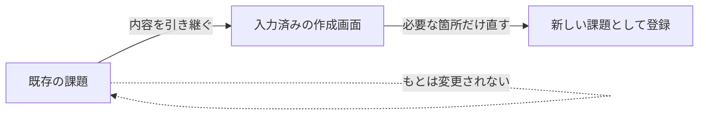

# 課題21：コピー機能の追加（🎨 自由設計課題）

| 項目 | 内容 |
|------|------|
| 難易度 | ★★★★☆☆（4/6） |
| 重要度 | ★★★★☆☆（4/6） |
| 前提課題 | [04 作成に項目を追加](04_create-add-fields.md)（あると役立つ：[06](06_edit-navigation.md)・[10](10_create-success-message.md)） |
| 学習項目 | フォームの事前入力・既存処理の再利用・**要件定義／画面設計** |
| 修正対象 | **自分で考える**（この課題は設計から自分で行います） |

---

> ## 🧩 この課題はこれまでと違います
>
> 仕様・画面・操作・修正対象ファイルまで、**すべて自分で設計する自由課題**です。
> 正解は1つではありません。**「何を作るべきか」を自分で定義すること**が、この課題のゴールの半分です。
> 詳しい手順や完成イメージはあえて載せていません。背景を読んで、自分なりの答えを設計してください。

---

## 🎯 背景（いちばん大切）

このアプリのユーザーは、日々たくさんの課題を登録します。そして、**似たような課題を何度も作る**ことがあります。

- 「定期メンテナンスA」を毎月登録する
- 「バグ報告」を、同じ説明テンプレートで何件も登録する
- さっき作った課題と、ほとんど同じ内容の課題をもう1件作る

ところが今の作成画面では、**毎回ゼロから全項目を入力**しなければなりません。
ユーザーはこれを **面倒** だと感じています。

> 「さっき作ったあの課題とほぼ同じなのに、また全部打ち直すの…？」

もし **既存の課題を“下敷き”にして、内容が入力済みの状態から新規作成を始められたら**、入力はぐっと楽になります。
このストレスを解消するのが、今回のあなたのミッションです。

---

## 📋 ゴール（＝達成したい状態 / 受け入れ条件）

**どう作るか**ではなく、**何が達成できていればOKか**だけを示します。実現方法はあなたが決めます。

- ✅ 既存の課題を「もと」にして、その内容が**あらかじめ入力された状態**で新規作成を始められる
- ✅ もとの課題は**変更されない**（あくまで “コピー” であって編集ではない）
- ✅ 必要な箇所だけ直して、**新しい課題として登録**できる

> これを「どの画面で・どんな操作で・どのURLで・どの項目をコピーして」実現するかは、**あなたの設計**です。

### 💡 考え方のイメージ（画面や操作は自分で設計してください）

---

## 🤔 自分で設計するための問い

手を動かす前に、次の問いに自分なりの答えを出してみましょう。ここが設計の出発点です。

- **どこから**コピーを始める？　一覧の各行にボタン？　詳細画面にボタン？
- ボタンの**文言**は？（「コピーして作成」「複製」など）
- **どの項目をコピーする？**　概要・説明はそのまま？　「（コピー）」を付ける？
  - ステータスや完了日・作成日もコピーする？　それとも初期値（未着手・空）に戻すのが自然？
- コピー後に開く画面は、**既存の作成画面を使い回す？**　それとも専用画面を作る？
- **URL** はどう設計する？（例：`/issues/{id}/copy` など）
- 既存のどの仕組みを**再利用**できる？

---

## 🧱 ヒント：再利用できそうな“既存の資産”

答えではなく、**考えるための材料**です。

- [課題04](04_create-add-fields.md) で作った **作成フォーム**（`creationForm.html` / `IssueForm`）
- [課題06](06_edit-navigation.md) でやった **「変更画面に既存の値を事前入力」** という考え方。
  コピーはこれにとても近いです（＝作成画面を “空” ではなく “既存の値入り” で開く）。
- [課題10](10_create-success-message.md) の **リダイレクト／リクエストパラメータ** の使い方

> 🔑 「新規作成画面を、既存課題の値であらかじめ埋めて開く」と捉えると、**課題06の応用**として設計の糸口が見えてきます。

---

## 📝 設計メモ（先に書き出すのがおすすめ）

実装の前に、自分の「仕様」をここに書き出してみましょう。

| 決めること | あなたの設計 |
|------------|--------------|
| コピー操作の起点（どこに置く） | |
| コピーする項目 / しない項目 | |
| 概要の扱い（例：「○○ のコピー」にする？） | |
| 使う画面（既存を流用 / 新規に作成） | |
| URL 設計 | |
| 再利用する既存処理 | |

---

## ✅ 動作確認（自分の仕様で）

まず、**自分が決めた受け入れ条件**を箇条書きにし、それを満たすか確認しましょう。最低限、以下は満たすこと。

- [ ] 既存課題をもとに、入力済みの状態で新規作成を始められる
- [ ] もとの課題が書き換わっていない（別の新規課題として登録される）
- [ ] コピー元と違う内容に直して登録できる
- [ ] （自分で追加した仕様）……
- [ ] （自分で追加した仕様）……

---

## 🧭 取り組み方のおすすめ

1. 背景を読み、「自分ならどう楽にするか」を**言葉にする**
2. 上の問いに答えて、**設計メモ**を埋める
3. 既存課題（特に [04](04_create-add-fields.md)・[06](06_edit-navigation.md)）の**どれを再利用するか**を決める
4. 実装し、**自分で決めた受け入れ条件**で確認する

> 💬 余裕があれば、「なぜその設計にしたのか」をコミットメッセージやメモに残してみましょう。
> 実務で求められる **「設計意図を説明する力」** の良い練習になります。

---

🏠 [課題一覧へ戻る](README.md)　｜　関連：[04 作成に項目を追加](04_create-add-fields.md)・[06 変更画面への遷移](06_edit-navigation.md)
