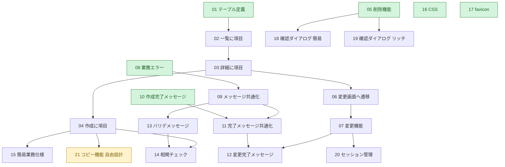

# 課題一覧

全21課題です（うち課題21は自由設計課題）。難易度・重要度はいずれも **6段階**（★が多いほど高い）。
「前提課題」は、先に終わらせておくとスムーズな課題です。

> 🟢 = まず取り組むのがおすすめ（前提課題なし）

|   #   | 課題                                                              | 難易度 | 重要度 | 前提課題 | 主な学習項目                 |
| :---: | ----------------------------------------------------------------- | :----: | :----: | -------- | ---------------------------- |
|  01   | [テーブル定義の追加](01_table-definition.md) 🟢                    | ★☆☆☆☆☆ | ★★★★★☆ | なし     | DBへの項目追加               |
|  02   | [一覧に項目を追加](02_list-add-columns.md)                        | ★★★☆☆☆ | ★★★★★☆ | 01       | 日付表示・表示項目編集       |
|  03   | [詳細に項目を追加](03_detail-add-columns.md)                      | ★★★☆☆☆ | ★★★★★☆ | 02       | 詳細画面の項目表示           |
|  04   | [作成に項目を追加](04_create-add-fields.md)                       | ★★★★☆☆ | ★★★★★☆ | 03       | 日付項目の入力               |
|  05   | [削除機能の追加](05_delete-feature.md) 🟢                          | ★★★★★☆ | ★★★★☆☆ | なし     | 削除ロジック                 |
|  06   | [変更画面への遷移](06_edit-navigation.md)                         | ★★★★★☆ | ★★★★☆☆ | 03       | 画面遷移                     |
|  07   | [変更機能の追加](07_edit-feature.md)                              | ★★★★★☆ | ★★★★☆☆ | 06       | 更新ロジック                 |
|  08   | [課題がない場合の業務エラー](08_not-found-error.md) 🟢             | ★★★☆☆☆ | ★★★★★★ | なし     | 業務エラー処理               |
|  09   | [メッセージの共通化](09_externalize-messages.md)                  | ★★☆☆☆☆ | ★★★★★★ | 08       | メッセージプロパティ         |
|  10   | [作成完了メッセージの表示](10_create-success-message.md) 🟢        | ★☆☆☆☆☆ | ★★★☆☆☆ | なし     | リダイレクトとパラメータ     |
|  11   | [完了メッセージの共通化](11_externalize-success-message.md)       | ★☆☆☆☆☆ | ★★★☆☆☆ | 09・10   | HTMLでのメッセージ読込       |
|  12   | [変更完了メッセージの表示](12_edit-success-message.md)            | ★☆☆☆☆☆ | ★★☆☆☆☆ | 07・11   | リダイレクトとパラメータ     |
|  13   | [バリデーションメッセージの変更](13_custom-validation-message.md) | ★☆☆☆☆☆ | ★★★★★★ | 09       | バリデーションメッセージ設定 |
|  14   | [相関チェックの実装](14_correlation-validation.md)                | ★★★☆☆☆ | ★★★★★☆ | 04・13   | 相関チェック                 |
|  15   | [簡易業務仕様の追加](15_auto-completion-date.md)                  | ★★☆☆☆☆ | ★★☆☆☆☆ | 04       | 業務ロジック                 |
|  16   | [CSSの追加](16_css.md) 🟢                                          | ★☆☆☆☆☆ | ★★★☆☆☆ | なし     | CSS                          |
|  17   | [ファビコンの設定](17_favicon.md) 🟢                               | ★☆☆☆☆☆ | ★☆☆☆☆☆ | なし     | favicon                      |
|  18   | [確認ダイアログの表示（簡易）](18_confirm-dialog-simple.md)       | ★☆☆☆☆☆ | ★★☆☆☆☆ | 05       | JSの直接記述                 |
|  19   | [確認ダイアログの表示（リッチ）](19_confirm-dialog-modal.md)      | ★★★★☆☆ | ★★☆☆☆☆ | 05       | Bootstrapモーダル            |
|  20   | [セッションによるデータ管理](20_session.md)                       | ★★★★★★ | ★★★★★☆ | 07       | セッション                   |
|  21   | [コピー機能の追加（自由設計課題）](21_copy-feature.md) 🎨          | ★★★★☆☆ | ★★★★☆☆ | 04       | フォームの事前入力・画面設計 |

> 🎨 **課題21** は、仕様・画面・動作を**自分で設計する自由課題**です。これまでの課題で身につけた知識を組み合わせて、ユーザーの「面倒」を解消する機能を自分でデザインしてみましょう。

---

## 🗺 依存関係マップ

どの課題から手をつければよいか迷ったら、この図を参考にしてください。矢印は「前提 → その課題」を表します。

---

## 🧭 おすすめの進行ルート

1. **基礎編（CRUD を完成させる）**：01 → 02 → 03 → 04 → 05 → 06 → 07
2. **業務エラー・メッセージ編**：08 → 09 → 13 / 10 → 11 → 12
3. **入力チェック編**：14 → 15
4. **UI改善編**：16 → 17 → 18 → 19
5. **応用編**：20（セッション）
6. **総仕上げ（自由設計）編**：21（コピー機能）— これまでの知識を組み合わせて自分で設計
