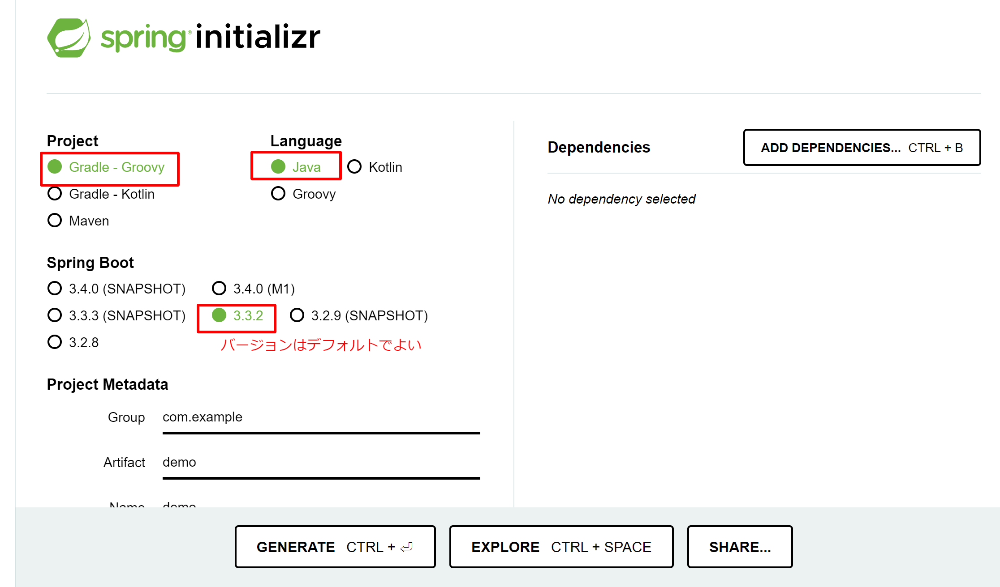
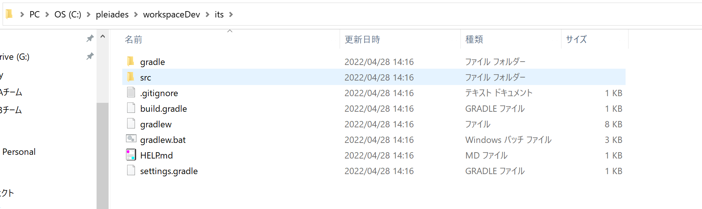
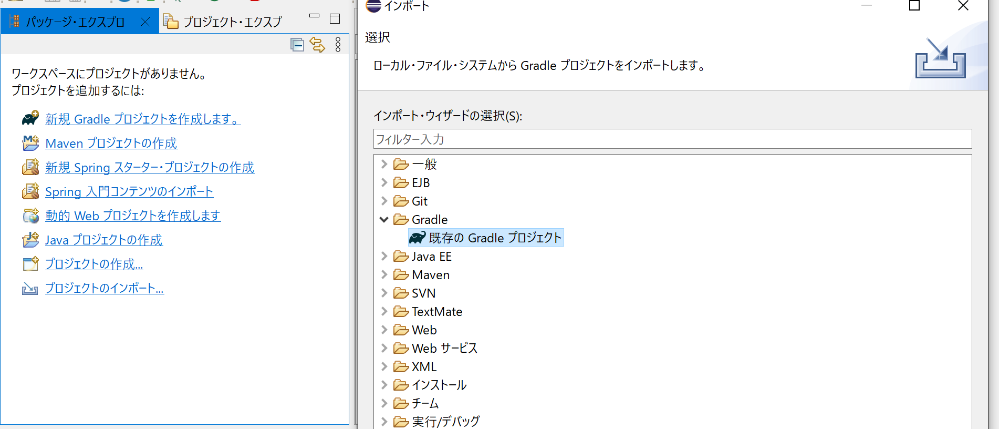
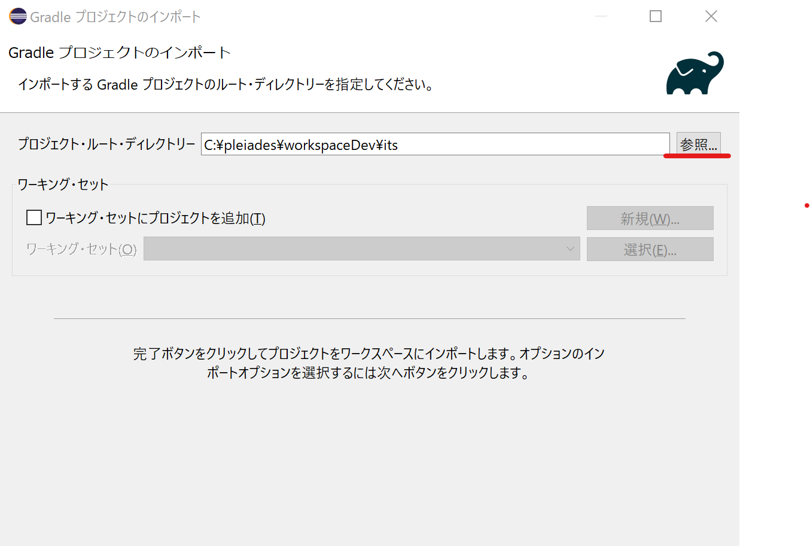
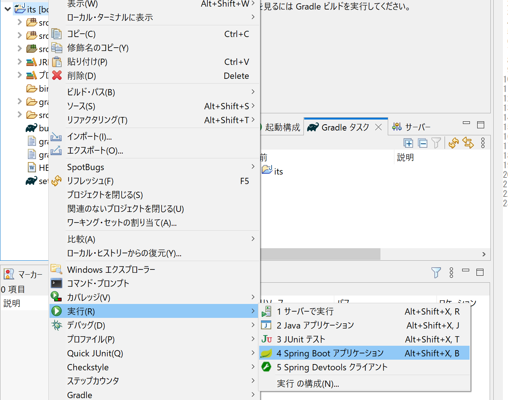
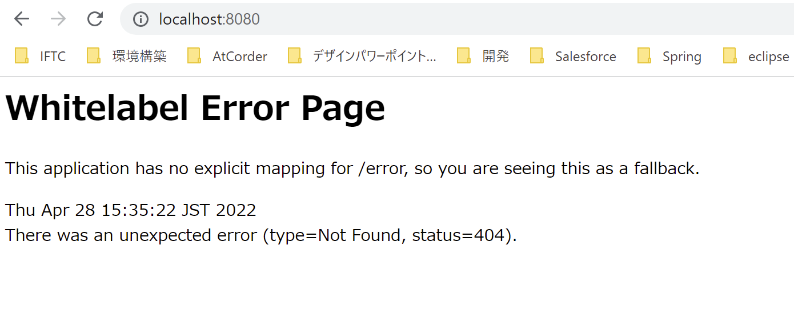
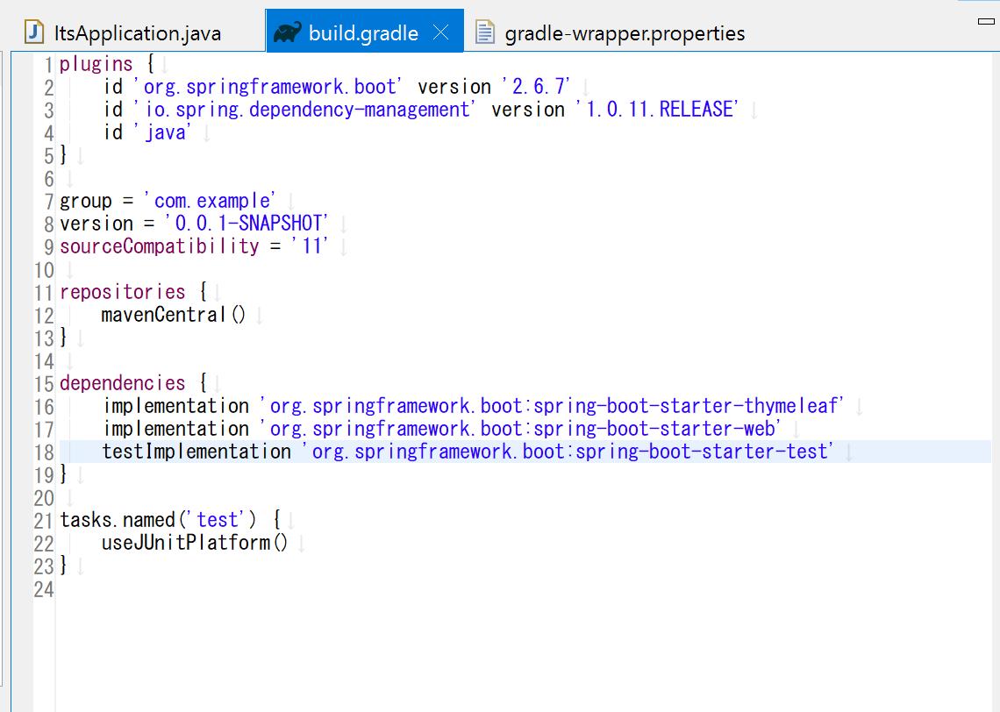

# 環境構築の補足（Eclipse / Pleiades 版）

Udemy講座は **IntelliJ IDEA** で進められますが、**Eclipse（Pleiades All in One）** でも同じアプリを開発できます。
このページは、Eclipse で進める場合のセットアップと、IntelliJ版との差分をまとめた補足資料です。

---

## 1. プロジェクトの作成（Spring Initializr）

[Spring Initializr](https://start.spring.io/) でプロジェクトのひな形を作成します。設定は以下の通り（バージョンはデフォルトでOK）。

| 項目        | 値                           |
| ----------- | ---------------------------- |
| Project     | Gradle - Groovy              |
| Language    | Java                         |
| Spring Boot | デフォルト（例：3.3.2 など） |
| Group       | `com.example`                |
| Artifact    | `demo`（任意）               |



`GENERATE` でダウンロードした zip を展開すると、次のような構成になります。



---

## 2. Eclipse へインポート

Eclipse の **パッケージ・エクスプローラー** で右クリック →「インポート」、または「プロジェクトのインポート…」から、
**Gradle → 既存の Gradle プロジェクト** を選択します。



「プロジェクト・ルート・ディレクトリー」に、展開したプロジェクトのフォルダを指定して「完了」。



---

## 3. アプリの実行

インポートしたプロジェクトを右クリック →「実行」→ **「Spring Boot アプリケーション」** を選びます。



起動後、ブラウザで <http://localhost:8080> を開くと **Whitelabel Error Page**（404）が表示されます。
これは「トップ（`/`）にコントローラーがまだ無い」だけで、**アプリ自体は正常に起動しています**。



参考までに、`build.gradle` を Eclipse のエディタで開くとこのようになっています。



---

## 4. IntelliJ版とのコードの差分

講座（IntelliJ）の動画と Eclipse で**書き方を変えたほうがよい**箇所があります。動画通りに書いてうまくいかないときは、ここを確認してください。

### ① `var` の代わりに `List.of()` を使う

`var` による型推論が環境によって扱いづらい場合、`List.of()` で明示的に書くと安定します。

```java
List<IssueEntity> issueList = List.of(
    new IssueEntity(1, "概要1", "説明1"),
    new IssueEntity(2, "概要2", "説明2"),
    new IssueEntity(3, "概要3", "説明3"));
```

### ② MyBatis の引数には `@Param` を付ける

複数引数を SQL に渡すときは、`@Param` で名前を明示します。

```java
@Insert("insert into issues (summary, description) values (#{summary}, #{description})")
void insert(@Param("summary") String summary,
            @Param("description") String description);
```

### ③ バリデーションの表示は `th:errorclass` を使う

入力チェックのエラー表示は、`th:classappend` で都度書くより `th:errorclass` を使うと簡潔です。

```html
<!-- 修正前 -->
<input type="text" id="summaryInput" th:field="*{summary}" class="form-control"
       th:classappend="${#fields.hasErrors('summary')} ? is-invalid">
<p class="invalid-feedback" th:if="${#fields.hasErrors('summary')}" th:errors="*{summary}">(error)</p>

<!-- 修正後 -->
<input type="text" id="summaryInput" th:field="*{summary}" class="form-control"
       th:errorclass="is-invalid">
<p class="invalid-feedback" th:errors="*{summary}">(error)</p>
```

---

## 🔗 参考リンク

- [Spring Initializr](https://start.spring.io/)
- [Pleiades All in One（Eclipse 日本語版）](https://willbrains.jp/)

---

🏠 [トップへ戻る](README.md) ／ 📚 [課題一覧へ](exercises/README.md)
